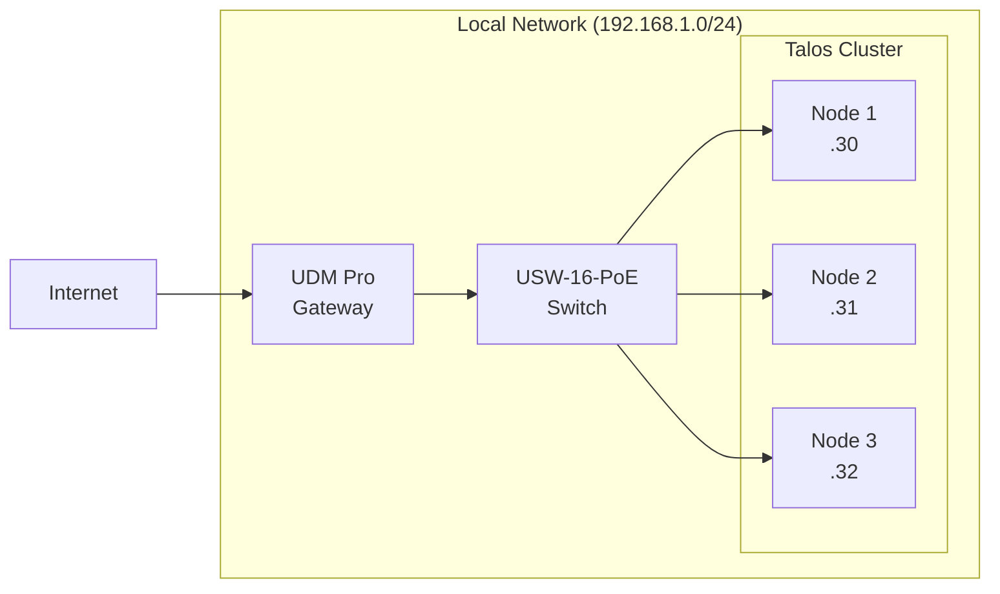
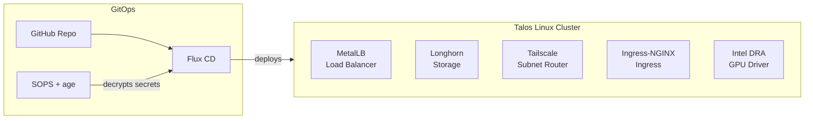
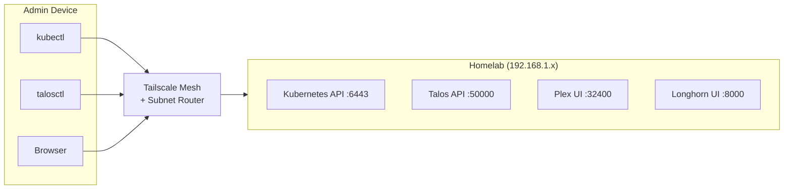
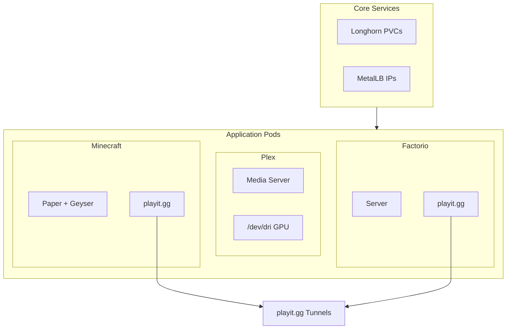

# Home Lab

A Kubernetes homelab running on Talos Linux, managed through GitOps. Currently running Plex (with Intel Arc GPU transcoding), Minecraft and Factorio game servers, and Tailscale for secure remote access.

## Getting Started

For complete setup instructions, see the [tutorial series](#documentation) starting with article 00.

### Prerequisites

For base development tools (kubectl, etc.), see [Dev Environment](https://lelopez.io/blog/dev-environment#development-tools).

Homelab-specific tools:

| Tool                                                  | Purpose                     |
| ----------------------------------------------------- | --------------------------- |
| [kubectl](https://kubernetes.io/docs/tasks/tools/)    | Kubernetes CLI              |
| [talosctl](https://talos.dev/install)                 | Talos cluster management    |
| [flux](https://fluxcd.io/flux/installation/)          | GitOps CLI                  |
| [sops](https://github.com/getsops/sops)               | Secret encryption           |
| [age](https://github.com/FiloSottile/age)             | Encryption backend for SOPS |
| [talhelper](https://github.com/budimanjojo/talhelper) | Talos config generator      |

```bash
# talosctl (use install script - brew can lag behind releases)
curl -sL https://talos.dev/install | sh

# GitOps and secrets
brew install fluxcd/tap/flux sops age talhelper
```

### Cluster Access

To manage the cluster from a new machine (requires the age private key):

```bash
cd <path-to-homelab>/talos

# Regenerate configs (only needed once per machine)
# Process substitution keeps the key in memory without writing to disk
SOPS_AGE_KEY_FILE=<(op document get "sops-key | homelab") talhelper genconfig

# Set environment variables
export TALOSCONFIG=$(pwd)/clusterconfig/talosconfig
export KUBECONFIG=$(pwd)/clusterconfig/kubeconfig

# Verify access
talosctl health
kubectl get nodes
```

### Repository Structure

```
homelab/
├── talos/                    # Cluster configuration
│   ├── talconfig.yaml        # Node definitions (talhelper)
│   └── talsecret.sops.yaml   # Encrypted cluster secrets
├── flux/                     # GitOps sync configuration
│   └── config/
│       └── sync.yaml         # Points Flux at k8s/
└── k8s/
    ├── core/                 # Infrastructure services
    │   ├── tailscale/        # VPN + subnet router
    │   ├── metallb/          # Load balancer
    │   ├── ingress-nginx/    # Ingress controller
    │   ├── longhorn/         # Distributed storage
    │   └── gpu/              # Intel GPU DRA driver
    └── apps/                 # Applications
        ├── plex/             # Media server
        ├── factorio/         # Game server
        └── minecraft/        # Game server
```

---

## Reference

### Hardware

| Component        | Model                   | Specs                                                            |
| ---------------- | ----------------------- | ---------------------------------------------------------------- |
| **Compute** (x3) | GEEKOM XT15 MEGA        | Intel Core Ultra 9 285H, Intel Arc 140T GPU, 32GB DDR5, 2TB NVMe |
| **Gateway**      | UniFi Dream Machine Pro | Router, firewall, UniFi controller                               |
| **Switch**       | UniFi USW-16-PoE        | 16-port managed, 8x PoE+, 2x SFP+                                |

### Key Technologies

| Layer         | Technology                                                                          | Purpose                             |
| ------------- | ----------------------------------------------------------------------------------- | ----------------------------------- |
| OS            | [Talos Linux](https://talos.dev)                                                    | Immutable, API-driven Kubernetes OS |
| Secrets       | [SOPS](https://github.com/getsops/sops) + [age](https://github.com/FiloSottile/age) | Encrypted secrets in Git            |
| CNI           | [Flannel](https://github.com/flannel-io/flannel)                                    | Pod networking across nodes         |
| GitOps        | [Flux CD](https://fluxcd.io)                                                        | Continuous deployment from Git      |
| VPN           | [Tailscale](https://tailscale.com)                                                  | Zero-trust remote access            |
| Load Balancer | [MetalLB](https://metallb.io)                                                       | Bare-metal LoadBalancer IPs         |
| Ingress       | [Ingress-NGINX](https://kubernetes.github.io/ingress-nginx/)                        | HTTP/HTTPS routing                  |
| Storage       | [Longhorn](https://longhorn.io)                                                     | Distributed block storage           |
| GPU           | [Intel DRA Driver](https://github.com/intel/intel-resource-drivers-for-kubernetes)  | Kubernetes-native GPU allocation    |
| Game Tunnels  | [playit.gg](https://playit.gg)                                                      | Public access for game servers      |

### Architecture

#### Physical / Network

Three mini PCs connected via UniFi switch to the internet.



#### Cluster Infrastructure

Flux CD pulls from GitHub and deploys to the cluster, decrypting secrets with SOPS.



#### Remote Access

Manage the cluster from anywhere via Tailscale subnet routing.



#### Applications

Game servers use playit.gg sidecars for public access without requiring Tailscale.



## Documentation

This repository accompanies a [tutorial series](https://lelopez.io/blog/homelab-v2-00-talos-kubernetes-homelab-series) documenting the complete build process.

> Articles with version tags link to milestone repo states. Articles without tags are reference guides that don't modify the repository.

| #   | Article                                                                                                        | Version                                                       |
| --- | -------------------------------------------------------------------------------------------------------------- | ------------------------------------------------------------- |
| 00  | [Talos Kubernetes Homelab Series](https://lelopez.io/blog/homelab-v2-00-talos-kubernetes-homelab-series)       |                                                               |
| 01  | [GEEKOM Mini PC Cluster Hardware](https://lelopez.io/blog/homelab-v2-01-geekom-mini-pc-cluster-hardware)       |                                                               |
| 02  | [UniFi Flat Network Setup](https://lelopez.io/blog/homelab-v2-02-unifi-flat-network-setup)                     |                                                               |
| 03  | [Talos Linux USB Installation](https://lelopez.io/blog/homelab-v2-03-talos-linux-usb-install)                  |                                                               |
| 04  | [SOPS and Age GitOps Secrets](https://lelopez.io/blog/homelab-v2-04-sops-age-gitops-secrets)                   | [v0.4.0](https://github.com/lelopez-io/homelab/tree/v0.4.0)   |
| 05  | [Talhelper Cluster Bootstrap](https://lelopez.io/blog/homelab-v2-05-talhelper-cluster-bootstrap)               | [v0.5.0](https://github.com/lelopez-io/homelab/tree/v0.5.0)   |
| 05a | [Talos Upgrade and Extensions](https://lelopez.io/blog/homelab-v2-05a-talos-upgrade-extensions)                |                                                               |
| 05b | [Talos Cluster Expansion and HA](https://lelopez.io/blog/homelab-v2-05b-talos-cluster-expansion-ha)            | [v0.9.1](https://github.com/lelopez-io/homelab/tree/v0.9.1)   |
| 06  | [Flux CD Kubernetes GitOps](https://lelopez.io/blog/homelab-v2-06-flux-cd-kubernetes-gitops)                   | [v0.6.0](https://github.com/lelopez-io/homelab/tree/v0.6.0)   |
| 06a | [Flux Helm Image Updates](https://lelopez.io/blog/homelab-v2-06a-flux-helm-image-updates)                      |                                                               |
| 07  | [Tailscale Kubernetes Subnet Router](https://lelopez.io/blog/homelab-v2-07-tailscale-kubernetes-subnet-router) | [v0.7.0](https://github.com/lelopez-io/homelab/tree/v0.7.0)   |
| 07a | [Tailscale ACL and Subnet Routes](https://lelopez.io/blog/homelab-v2-07a-tailscale-acl-subnet-routes)          |                                                               |
| 07b | [Tailscale High Availability](https://lelopez.io/blog/homelab-v2-07b-tailscale-high-availability)              | [v0.9.2](https://github.com/lelopez-io/homelab/tree/v0.9.2)   |
| 07c | [Tailscale Mac Bastion Host](https://lelopez.io/blog/homelab-v2-07c-tailscale-mac-bastion-ssh)                 |                                                               |
| 08  | [MetalLB, Longhorn, and Ingress-NGINX](https://lelopez.io/blog/homelab-v2-08-metallb-longhorn-ingress-nginx)   | [v0.8.0](https://github.com/lelopez-io/homelab/tree/v0.8.0)   |
| 09  | [Intel Arc Kubernetes DRA](https://lelopez.io/blog/homelab-v2-09-intel-arc-gpu-kubernetes-dra)                 | [v0.9.0](https://github.com/lelopez-io/homelab/tree/v0.9.0)   |
| 10  | [Plex Intel GPU Transcoding](https://lelopez.io/blog/homelab-v2-10-plex-intel-gpu-transcoding)                 | [v0.10.0](https://github.com/lelopez-io/homelab/tree/v0.10.0) |
| 11  | [Factorio Kubernetes Server](https://lelopez.io/blog/homelab-v2-11-factorio-kubernetes-server)                 | [v0.11.0](https://github.com/lelopez-io/homelab/tree/v0.11.0) |
| 11a | [Factorio playit.gg Public Access](https://lelopez.io/blog/homelab-v2-11a-factorio-playit-public-access)       | [v0.11.1](https://github.com/lelopez-io/homelab/tree/v0.11.1) |
| 11b | [Factorio Import Existing Save](https://lelopez.io/blog/homelab-v2-11b-factorio-import-existing-save)          | [v0.11.2](https://github.com/lelopez-io/homelab/tree/v0.11.2) |
| 11c | [Factorio Security Hardening](https://lelopez.io/blog/homelab-v2-11c-factorio-security-hardening)              | [v0.11.3](https://github.com/lelopez-io/homelab/tree/v0.11.3) |
| 11d | [Factorio Server Management](https://lelopez.io/blog/homelab-v2-11d-factorio-server-management)                |                                                               |
| 12  | [Minecraft Paper Server](https://lelopez.io/blog/homelab-v2-12-minecraft-paper-server)                         | [v0.12.0](https://github.com/lelopez-io/homelab/tree/v0.12.0) |
| 12a | [Minecraft playit.gg Public Access](https://lelopez.io/blog/homelab-v2-12a-minecraft-playit-public-access)     | [v0.12.1](https://github.com/lelopez-io/homelab/tree/v0.12.1) |
| 12b | [Minecraft Import Existing World](https://lelopez.io/blog/homelab-v2-12b-minecraft-import-existing-world)      | [v0.12.2](https://github.com/lelopez-io/homelab/tree/v0.12.2) |
| 12c | [Minecraft Bedrock Support](https://lelopez.io/blog/homelab-v2-12c-minecraft-bedrock-support)                  | [v0.12.3](https://github.com/lelopez-io/homelab/tree/v0.12.3) |
| 12d | [Minecraft Server Management](https://lelopez.io/blog/homelab-v2-12d-minecraft-server-management)              |                                                               |

## License

[MIT](LICENSE)
